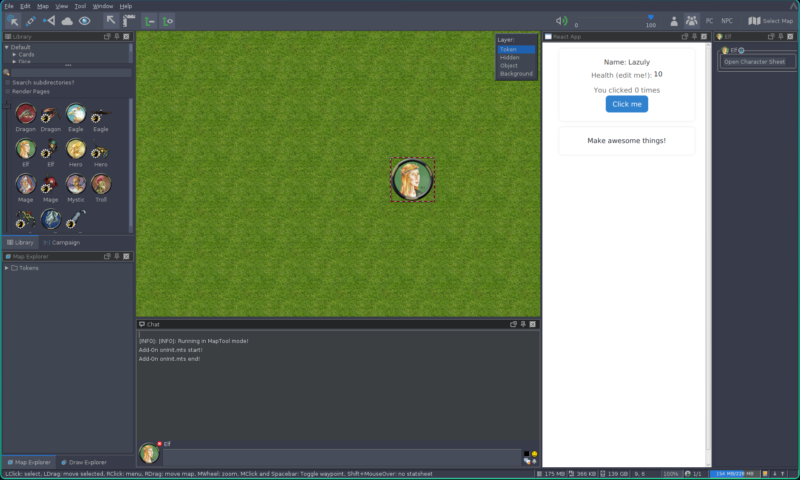

# Maptool Character Sheet with React

This project provides a basic template for you to create your custom character sheet in MapTools using React, Typescript and Chakra-UI.
You can either run this template in MapTool or in a web browser.

The example character sheet displays basic stats of a fictional character.
Some of the stats can be modified by double clicking on them.
Also, a button increases a count, whose state persist using a React state.



Requires at least MapTool v1.14.3

## Example Campaign

You can test the example campaign file under `example.cmpgn`.

This contains a single Elf Token with a "Open Character Sheet" macro that opens the character sheet as a separate window.

## Build Instructions for Linux

If you want to modify this template and distribute your own version, follow this instructions.

### Requirements

#### Linux

You need to install nodejs, yarn, and create-react-app.

#### nix (optional)

If using nix, you can install all dependencies with:

```sh
$ nix profile install nixpkgs#nodejs nixpkgs#yarn nixpkgs#nodePackages.create-react-app
```

### Common

Install npm dependencies:
```sh
$ cd <root>/src
$ npm run install
```

### MapTool

Once all dependencies have been installed, simply run the provided distributions script.
The addon will be placed in `lib/lib.mtlib`.

```sh
$ <root>/dist.sh
```

Then load your addon on MapTool using the Add-On dialog under `File->Add On Libraries...`.

To open the character sheet you need to create a macro for a token that will start the "Frontend" for that token.

The macro should look like:

```
[h: tokenId = currentToken()]
[h: html.frame5("react",
  "lib://com.gitlab.aleixrocks.charactersheet/frontend/index.html",
  'value={"currentTokenId": "'+tokenId+'"}'
)]
```

### Web Broser

Running in a web browser makes it easier to debug, because you can access the web console and debug tools.
When using the web browser version, you don't need to create a MapTool addon, but you need to build the react project.

```sh
$ cd <root>/src
$ npm run build
```

Then, start the backend

```sh
$ cd <root>/src/backend
$ npm run start
```

In a new terminal, start the frontend (the character sheet itself):

```sh
$ cd <root>/src/frontend
$ npm run start
```

Your default browser should open an display the character sheet.

## Debug

You can enable Frontend debug logs by editing `src/frontend/.env` and changing

```sh
REACT_APP_DEBUG=false
```

to 

```sh
REACT_APP_DEBUG=true
```

To enable the Backend debug logs, edit `src/backend/src/logger.ts` and change

```ts
const isDebugEnabled = false;
```

to

```ts
const isDebugEnabled = true;
```

## Design

This template follows a Client-Server parading, where the Server is the MapTools GraalVM machine and the Clients are HTML5 frame character sheets.
The Backend provides an interface for servicing MapTool tokens' data to the Client.
The Client requests data to the Backend and displays them in form of a character sheet.
Also, the Client sends data back to the Backend if the user updates the character sheet.
The character sheet details are represented by a JSON object that is stored as a single field named "data" into the Token that invokes the character sheet.
How the Backend works depends on if running inside MapTool or in a web browser.

When the Add-On is loaded into MapTool, the backend (`src/backend`) is started automatically.
When the user selects a Token and clicks the "Open Character Sheet" macro of the provided example, the macro first obtains the selected token identifier and then opens a new HTML5 frame (`src/frontend`) where the token id is passed as a parameter.
The Frontend uses the provided token id on future requests to the Backend to obtain or update its data.
Once requested, the Backend retreives or stores the data in the MapTool Token's key-value database using the MapTool API.

If running outside MapTool, both the backend and the frontend need to be started separately.
The Frontend uses a fake TokenId to request data to the Backend.
The Backend uses a fallback MapTool API that mimics the original to access data.

When opening a character sheet on a new token for the first time, the backend provides a default character sheet.

## TODO

 - Implement a generic inter-frontend communication
 - Implement a generic sheet stats data viewer/editer
 - Add notes on how building works (webpack, add-on template)
 - Add notes on mt and js init scripts 

## FAQ

### What do I need to learn to understand all this?
 - Web Design
   - [HTML](https://developer.mozilla.org/en-US/docs/Learn/HTML)
   - [JavaScript](https://developer.mozilla.org/en-US/docs/Learn/JavaScript)
   - [React](https://react.dev/learn)
   - [Chakra-UI](https://www.chakra-ui.com/docs/components/concepts/overview)
 - MapTool
   - [Macros](https://wiki.rptools.info/index.php/Introduction_to_Macro_Writing)
   - [Addons](https://wiki.rptools.info/index.php/Add-On_Library)
   - [MapTool GraalVM/Frame API](https://wiki.rptools.info/index.php/Category:Javascript_Function)

